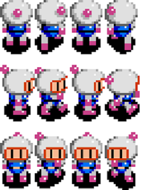

# Bomberman

Références Textures:

. 
https://lh3.googleusercontent.com/proxy/qL_AGixqagYmjfW1hLtV-ISUca56KZ8FVoEEitWeGFfVqrsGntCQYHJrGb7ofz4BkXFx6ZkyaFprpBE8XpvsFpwhDO8PusKnmu1TxfcpZg. 
. 
https://lh3.googleusercontent.com/proxy/qL_AGixqagYmjfW1hLtV-https://manalun.github.io/images/bomberman-sprite-sheet.png. 
. 
http://i.imgur.com/eKD88.png. 
. 
https://preview.redd.it/ent0tfm3abv01.png?auto=webp&s=c501527385252fe4244996ecf182ed4b87e8c669. 
. 
https://www.spriters-resource.com/snes/sbomber5/sheet/44411/?source=genre. 
. 
https://www.spriters-resource.com/resources/sheets/57/60462.png?updated=1460962535. 
. 
https://www.nintendo-master.com/fichiers/news_covers_medium/konami-explique-la-signification-du-r-de-super-bomberman-r-47533-2777.jpg. 
